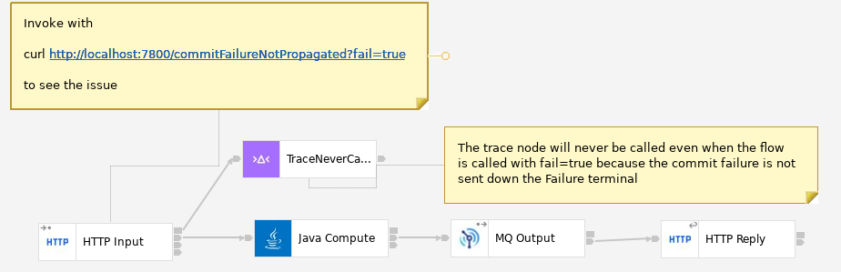
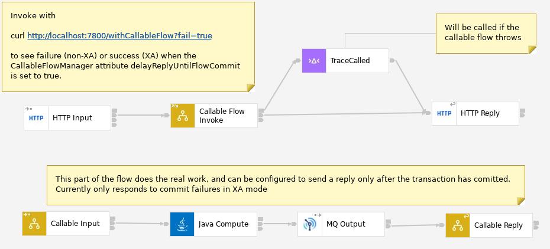

# ace-commit-failure
Projects to illustrate commit failure issues

## 01-CommitFailureNotPropagated

This flow shows the issue, in that even when invoked with fail=true the trace node is
still never called because the commit failure happens in the background.

## 02-WithCallableFlow

This flow has an extra stage added in, and would trigger the trace node if a commit 
occurs in the callable flow as long as the flow is running in XA (coordinated transaction)
mode. Without XA coordination, this flow behaves the same way as the 01 flow.

